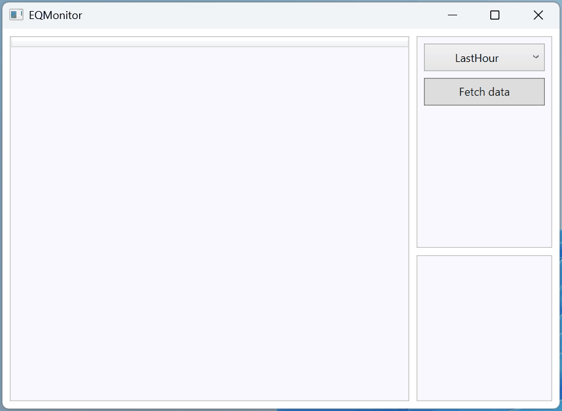

## Summary

This is a `Hello world!` app that pulls and shows earthquake data from [USGS](https://www.usgs.gov/).
I wanted this to be something cooler, but then life happened, so all you get is a window with a button :)

## Building
Check the Visual Studio, JetBrains Rider or .NET CLI docs on how to build stuff (you'll need .NET 8).

## License
[Unlicense.](https://unlicense.org/)
